# Auto Leasing Project

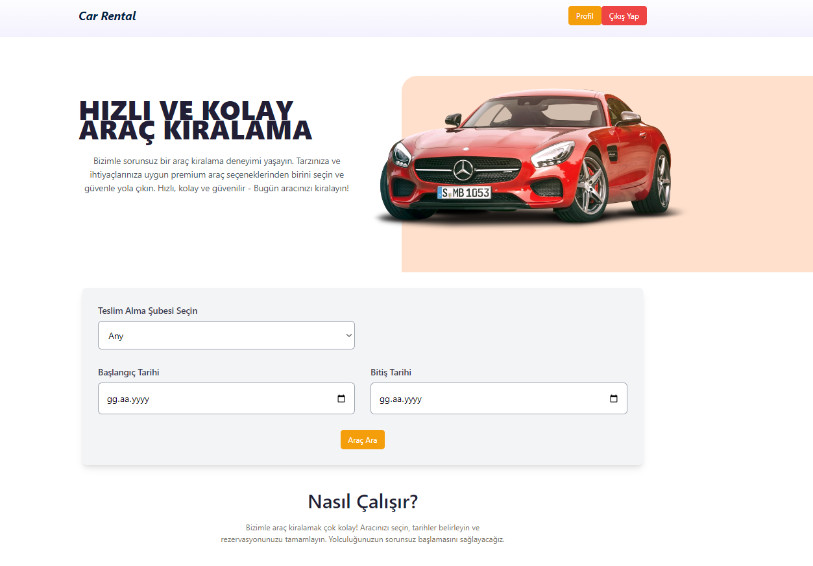

## 🚀 About the Project

**Auto Leasing** is a web application developed as part of the Database Management Systems course at Düzce University. I would like to introduce this project, which I developed with my teammates [Muhammed Talha Bulut](https://www.linkedin.com/in/muhammedblt/) ve [Uğur Avşar](https://www.linkedin.com/in/uğur-avşar-471a69231/) .  
We built this project using **C#** and **ASP.NET**, and connected it to a database using **SQL**. The server-side database is powered by **Microsoft SQL Server**.

---

## 🛠️ Features

- 🚀 **Admin Panel**: Our admin panel provides a wide range of features such as adding new vehicles, adding new employees, receiving vehicle returns, managing branches, and generating inter-branch reports.
- 🌟 **Multi-Branch Support**: The project supports a multi-branch structure, offering users a variety of options.
- 🛡️ **User-Friendly Interface**: Designed with user convenience in mind, the system includes features like rental history, detailed rental reports, and much more.

---

## 📸 Screenshots

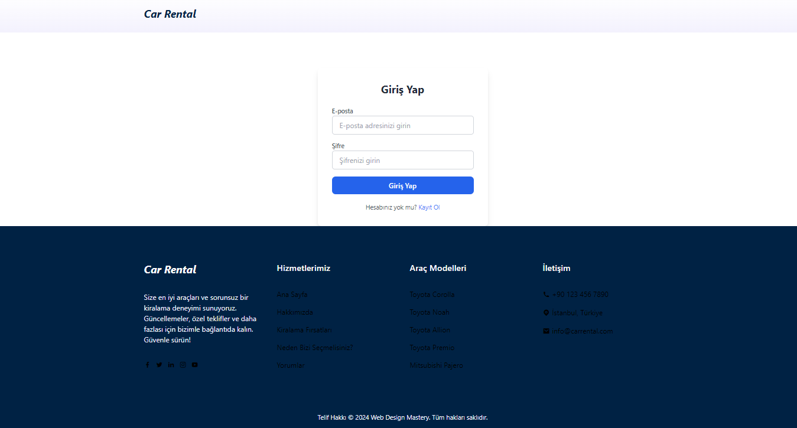
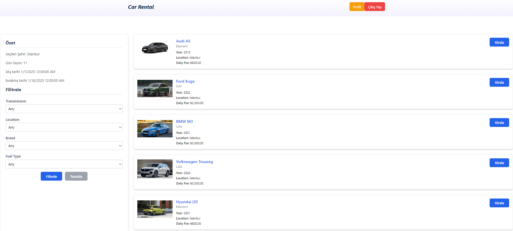
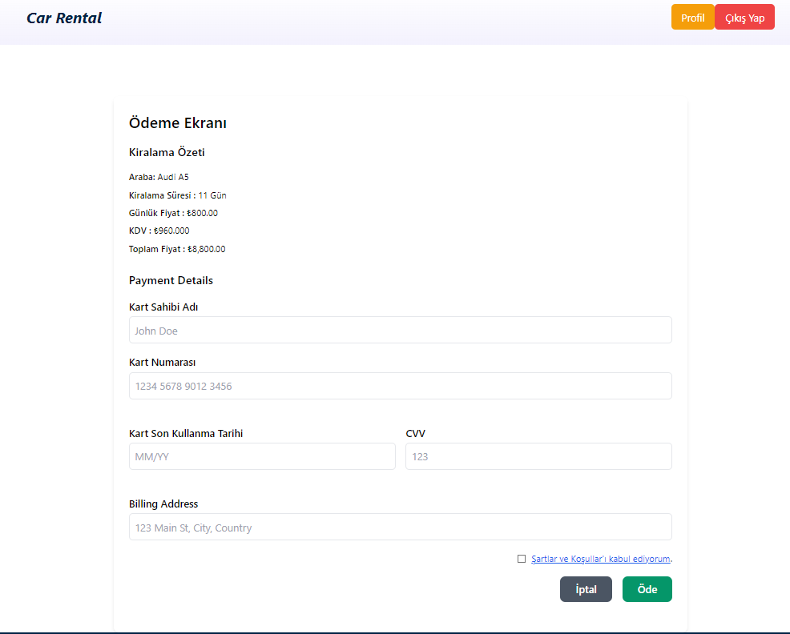
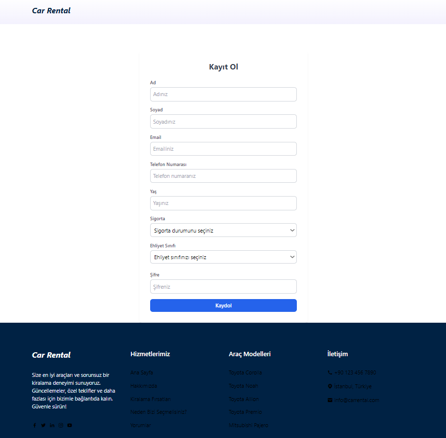
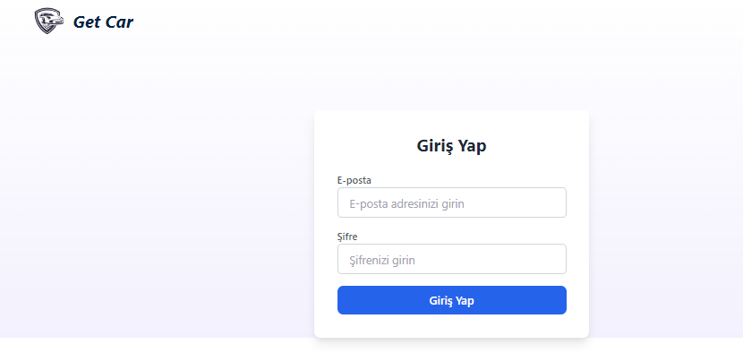
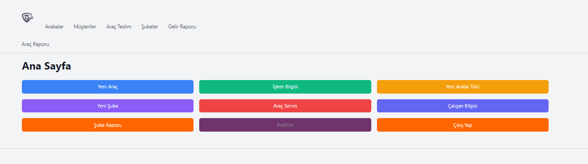
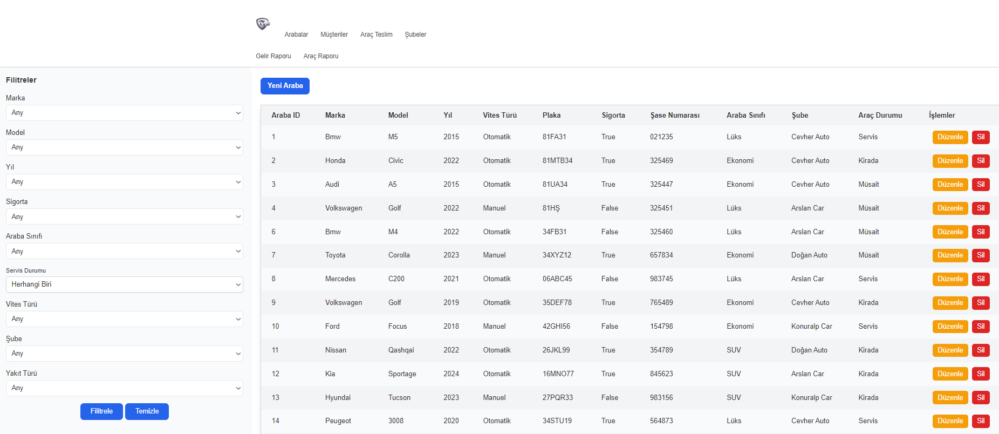
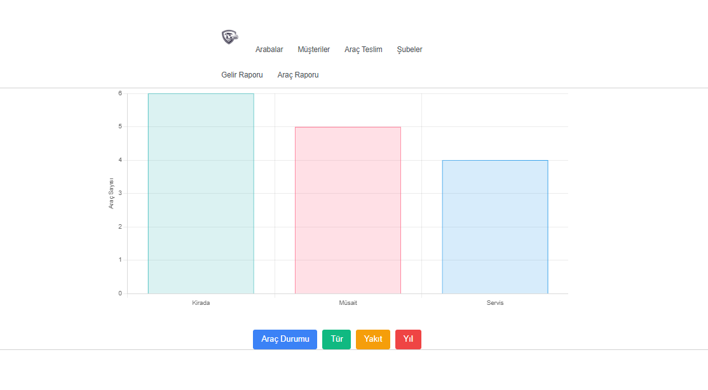

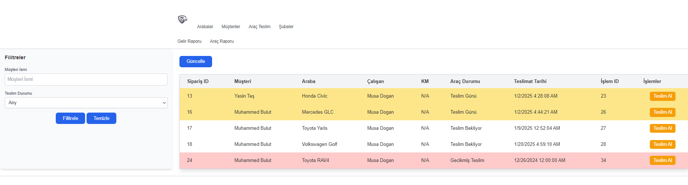
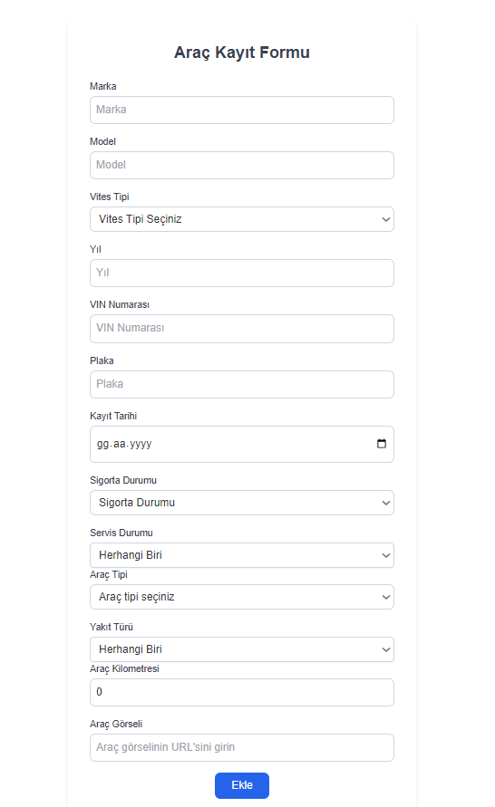
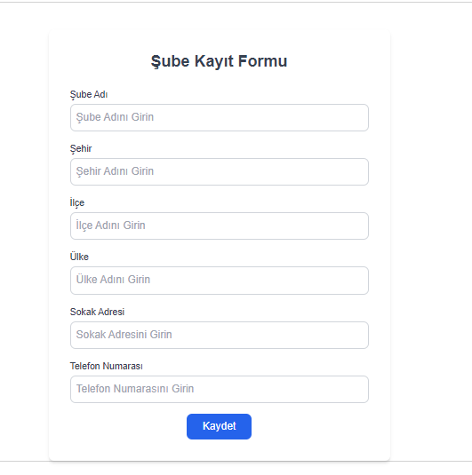
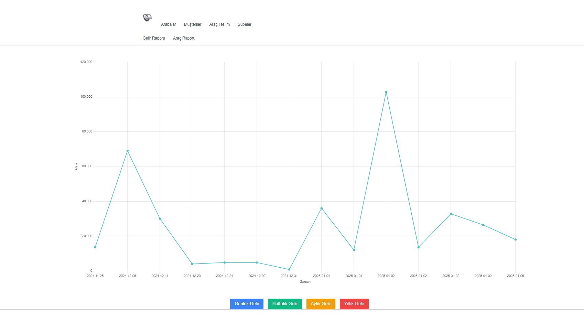
