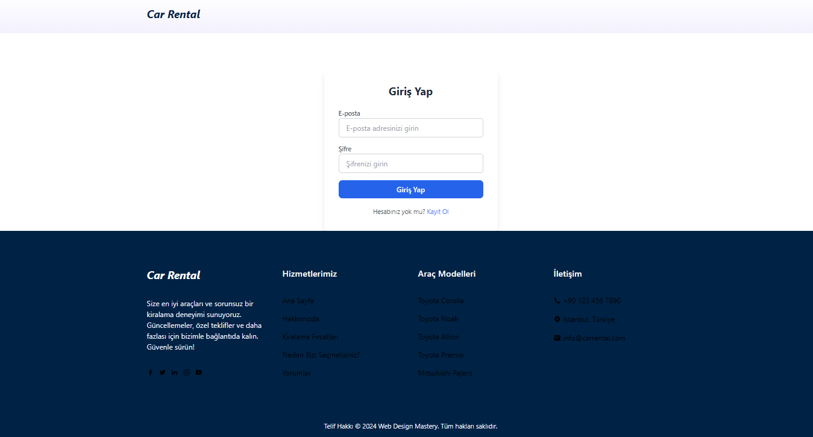
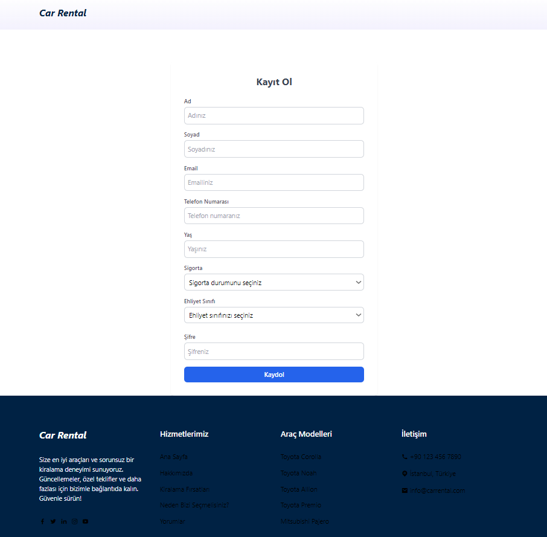
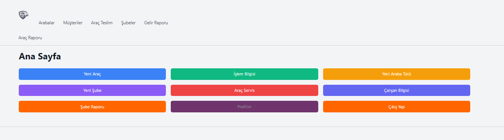
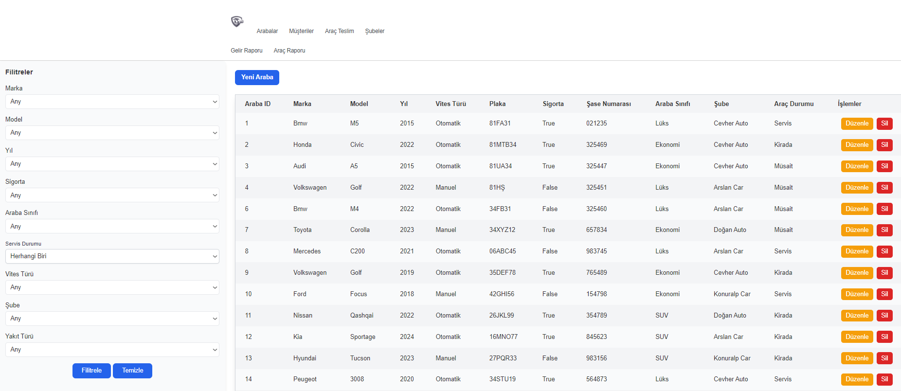
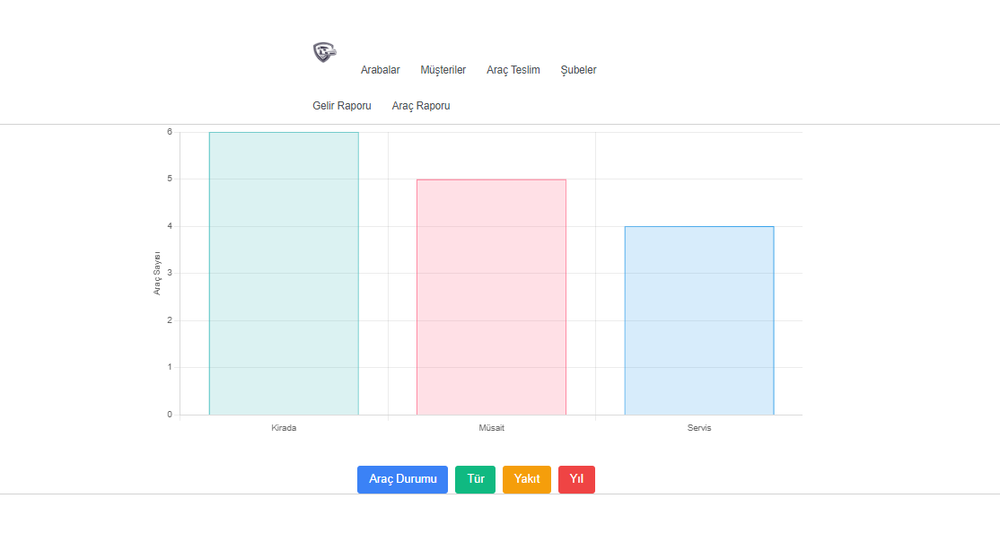
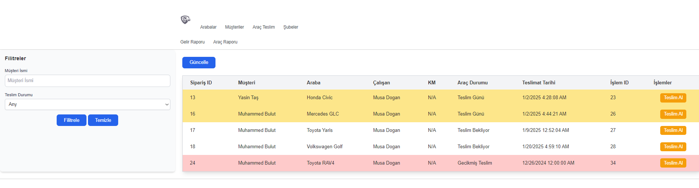
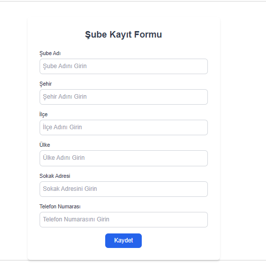
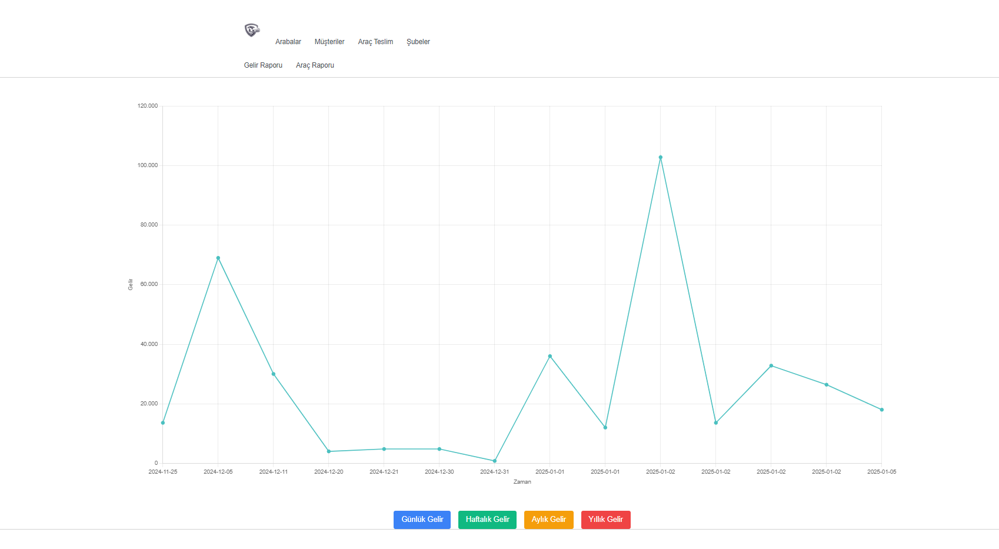

# Auto Leasing (Araç Kiralama) Projesi

## 🚀 Proje Hakkında

**Auto Leasing**, Merhabalar, Düzce Üniversitesi Database Managment System dersi kapsamında yaptığımız Auto Leasing Web sitesini tanıtmak isterim. Takım arkadaşlarım [Muhammed Talha Bulut](https://www.linkedin.com/in/muhammedblt/) ve [Uğur Avşar](https://www.linkedin.com/in/uğur-avşar-471a69231/) ile birlikte yaptık.
C# ve asp.net kullanarak yaptığımız projemizi SQL kullanarak database bağladık. Server olarak Microsoft SQL Server  kullandık.

## 🛠️ Özellikler

- 🚀 **Admin Paneli**: [Admin panelimiz sayesinde yeni araç ekleme, yeni çalışan ekleme, araç teslim alma, şube ve şubeler arası raporlar gibi bir çok özellik sağlamaktadır.]
- 🌟 **Çoklu Şube Yapısı**: [Çoklu şube yapısına destek veren projemiz kullanıcılara birden fazla seçenek sunmaktadır.]
- 🛡️ **Kullanıcı Dostu**: [Kullanıcılar düşünülerek yapılan sitemizde kiralama geçmişi, kiralama raporları gibi bir çok özellik sunmaktadır.]

---

## 📸 Ekran Görüntüleri

